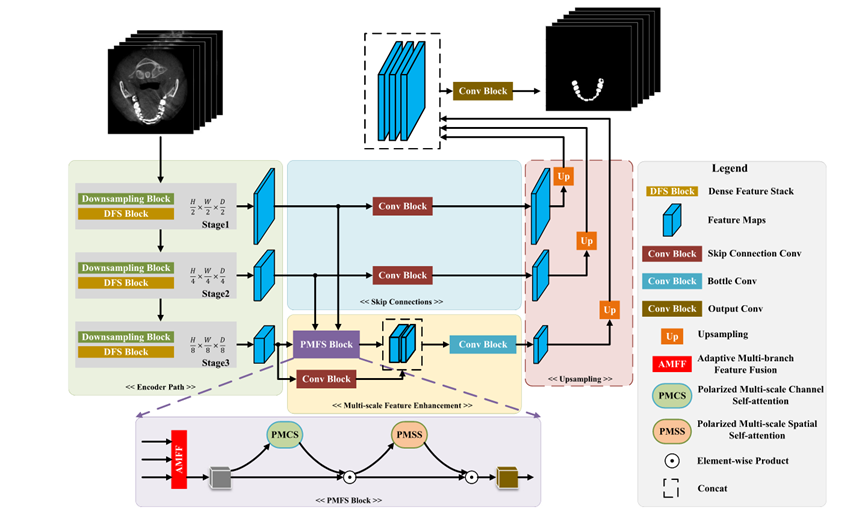
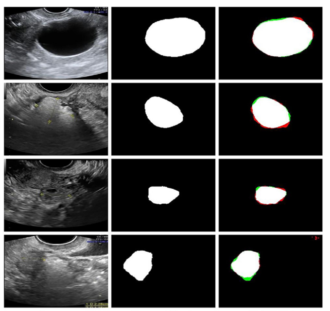

# PMFSNet

论文复现：



数据集：

[MMTO](https://pan.baidu.com/share/init?surl=0AT7fqgbK2s507tr1MfpTQ&pwd=mo3c)

[ISIC-2018](https://pan.baidu.com/s/16vla-i12GSwjqTTGc0CXSA?pwd=qola)

[NC-release-data-checked](https://pan.baidu.com/s/10qf6k10GE9OHYcJ76wrx-w?pwd=6ad8)

训练命令参数：

```py
--dataset: dataset name
--model: model name
--pretrain_weight: pre-trained weight file path
--dimension: dimension of dataset images and models, for PMFSNet only
--scaling_version: scaling version of PMFSNet, for PMFSNet only
--epoch: training epoch
```

训练命令：

```py
python ./train.py --dataset MMOTU --model PMFSNet --pretrain_weight ./pretrain/PMFSNet2D-basic_ILSVRC2012.pth --dimension 2d --scaling_version BASIC --epoch 2000
```

测试集验证命令(命令参数同训练)：

```py
python ./test.py --dataset MMOTU --model PMFSNet --pretrain_weight ./pretrain/PMFSNet2D-BASIC_MMOTU.pth --dimension 2d --scaling_version BASIC
```

图片分割推理命令：

```py
python ./inference.py --dataset MMOTU --model PMFSNet --pretrain_weight ./pretrain/PMFSNet2D-BASIC_MMOTU.pth --dimension 2d --scaling_version BASIC --image_path ./images/453.JPG
```

结果：



训练结果：

| Method          | FLOPs(G) | Params(M) | IoU(%) | mIoU(%) |
| --------------- | -------- | --------- | ------ | ------- |
| PSPNet          | 38.71    | 53.32     | 82.01  | 89.41   |
| DANet           | 10.95    | 47.44     | 82.20  | 89.53   |
| SegFormer       | 2.52     | 7.72      | 82.46  | 89.88   |
| U-Net           | 41.90    | 31.04     | 79.91  | 86.80   |
| TransUNet       | 24.61    | 105.28    | 81.31  | 89.01   |
| BiseNetV2       | 3.40     | 5.19      | 79.37  | 86.13   |
| PMFSNet2D-BASIC | 2.21     | 0.99      | 81.35  | 88.93   |
